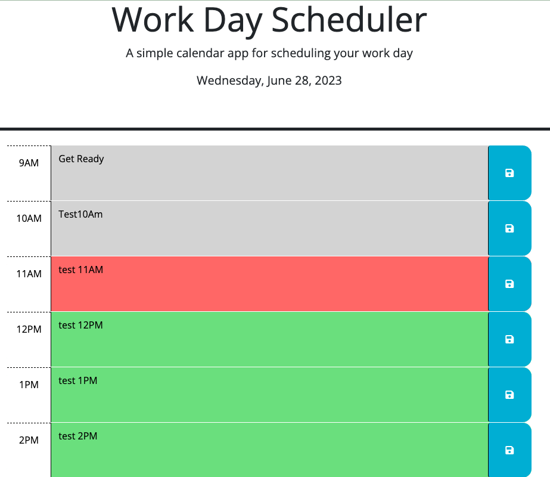

# Work Day Scheduler

## Description

Work Day Scheduler is a calendar application that allows users to save events for each hour of a working day. The working hours start from 9 AM to 5 PM. Users can also edit the saved events.

The application is built using HTML, CSS, and JavaScript. It utilizes the Bootstrap framework for styling and jQuery for interactivity. Day.js is used for date and time manipulation.

## Installation

This is a browser-based application. To install and use it, follow these steps:

1. Download or clone the codebase from the [GitHub repository](https://github.com/bazrahimi/day-scheduler).

2. Open the `index.html` file in a web browser.

3. Ensure that you have the following dependencies included:
   - Bootstrap: Link to the Bootstrap CSS and JavaScript files in your HTML.
   - jQuery: Link to the jQuery library in your HTML.
   - Day.js: Link to the Day.js library in your HTML.

## Usage

1. Once the application is open in your browser, you will see the current date displayed at the top of the page.

2. The time blocks from 9 AM to 5 PM are displayed, representing each hour of the working day.

3. To save an event, type it into the text area for the corresponding hour and click the save button (represented by a floppy disk icon). The event will be saved, and you can reload the page to see the saved events persist.

4. To edit an event, simply overwrite the existing text in the text area for the corresponding hour and click the save button. The edited event will be saved and displayed accordingly.

5. The time blocks are color-coded to indicate past, present, and future events. Past events are displayed with a gray background, the current hour has a red background, and future events have a green background.

## Credits

- Developed by [Baz Rahimi](https://github.com/bazrahimi).
- Zoom Recording: [Zoom Recording Link](https://applications.zoom.us/lti/rich/home/recording/detail)

## License

The code is released under the MIT License. Feel free to use, modify, and distribute it.
